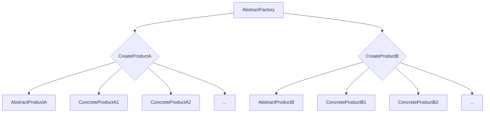
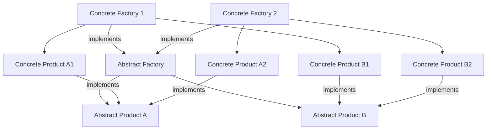

# Abstract Factory

```mermaid
graph TD
    A[AbstractFactory]
    A --> B{CreateProductA}
    A --> C{CreateProductB}
    B --> D[AbstractProductA]
    B --> E[ConcreteProductA1]
    B --> F[ConcreteProductA2]
    C --> G[AbstractProductB]
    C --> H[ConcreteProductB1]
    C --> I[ConcreteProductB2]
    B --> J[...]
    C --> K[...]
```

```mermaid
graph TD
    A[Abstract Factory] --> B[Abstract Product A]
    A --> C[Abstract Product B]
    D[Concrete Factory 1] -->|implements| A
    D --> E[Concrete Product A1]
    E -->|implements| B
    D --> F[Concrete Product B1]
    F -->|implements| C
    G[Concrete Factory 2] -->|implements| A
    G --> H[Concrete Product A2]
    H -->|implements| B
    G --> I[Concrete Product B2]
    I -->|implements| C
```
