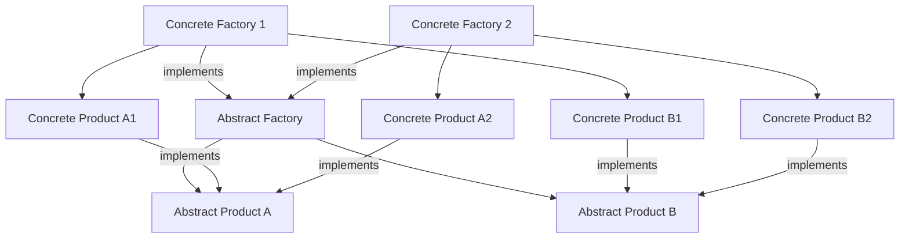

# Abstract Factory

El patrón abstract factory es un patrón de diseño creacional que permite crear familias de objetos relacionados sin especificar sus clases concretas. Las claves del patrón abstract factory son:

- La interfaz abstract factory declara un conjunto de métodos para crear cada uno de los productos abstractos.
- Las clases concrete factory implementan los métodos de la interfaz abstract factory y crean los productos concretos correspondientes.
- Las interfaces abstract product declaran las operaciones que todos los productos concretos deben implementar.
- Las clases concrete product implementan las interfaces abstract product y definen el comportamiento específico de los productos.
- El código cliente usa la interfaz abstract factory para crear una familia de productos relacionados. El código cliente no depende de las clases concretas de los productos, sino solo de sus interfaces abstractas.
