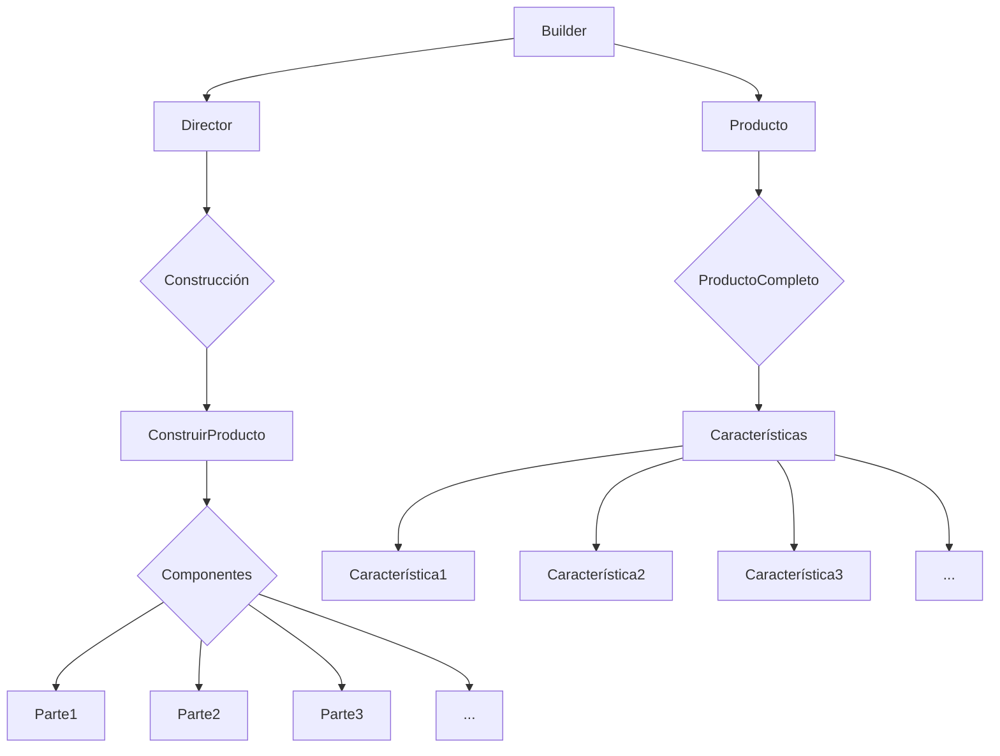
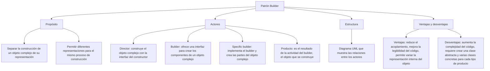

# Builder

```mermaid
graph TD
    A[Builder]
    A --> B[Director]
    A --> C[Producto]
    B --> D{Construcción}
    D --> E[ConstruirProducto]
    E --> F{Componentes}
    F --> G[Parte1]
    F --> H[Parte2]
    F --> I[Parte3]
    F --> J[...]
    C --> K{ProductoCompleto}
    K --> L[Características]
    L --> M[Característica1]
    L --> N[Característica2]
    L --> O[Característica3]
    L --> P[...]
```

```mermaid
graph TD
    A[Patrón Builder] --> B[Propósito]
    A --> C[Actores]
    A --> D[Estructura]
    A --> E[Ventajas y desventajas]
    B --> F[Separar la construcción de un objeto complejo de su representación]
    B --> G[Permitir diferentes representaciones para el mismo proceso de construcción]
    C --> H[Director: construye el objeto complejo con la interfaz del constructor]
    C --> I[Builder: ofrece una interfaz para crear los componentes de un objeto complejo]
    C --> J[Specific builder: implementa el builder y crea las partes del objeto complejo]
    C --> K[Producto: es el resultado de la actividad del builder, el objeto que se construye]
    D --> L[Diagrama UML que muestra las relaciones entre los actores]
    E --> M[Ventajas: reduce el acoplamiento, mejora la legibilidad del código, permite variar la representación interna del objeto]
    E --> N[Desventajas: aumenta la complejidad del código, requiere crear una clase abstracta y varias clases concretas para cada tipo de producto]

```
