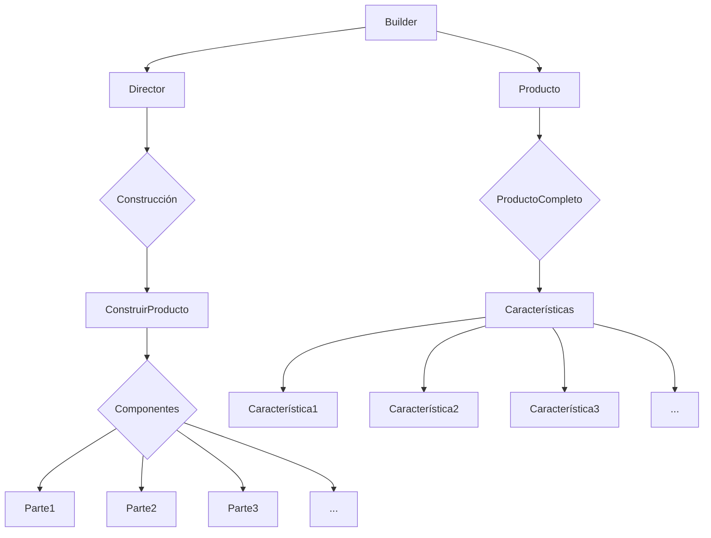

# Builder

El patrón Builder se utiliza cuando un objeto complejo necesita ser construido con múltiples componentes y configuraciones. El Director coordina el proceso de construcción utilizando el Builder, y el producto resultante tiene todas las características deseadas. Esto permite una construcción más flexible y legible de objetos complejos.  
- Builder: Es el componente principal que construye el producto paso a paso.
- Director: Coordina la construcción del producto utilizando el Builder.
- Producto: El producto que se está construyendo.
- Construcción: El proceso de construir el producto.
- ConstruirProducto: La acción de ensamblar el producto paso a paso.
- Componentes: Las partes que componen el producto.
- Parte1, Parte2, Parte3, ...: Ejemplos de componentes que conforman el producto.
- ProductoCompleto: El producto final construido.
- Características: Las características del producto completo.
- Característica1, Característica2, Característica3, ...: Ejemplos de características del producto.

