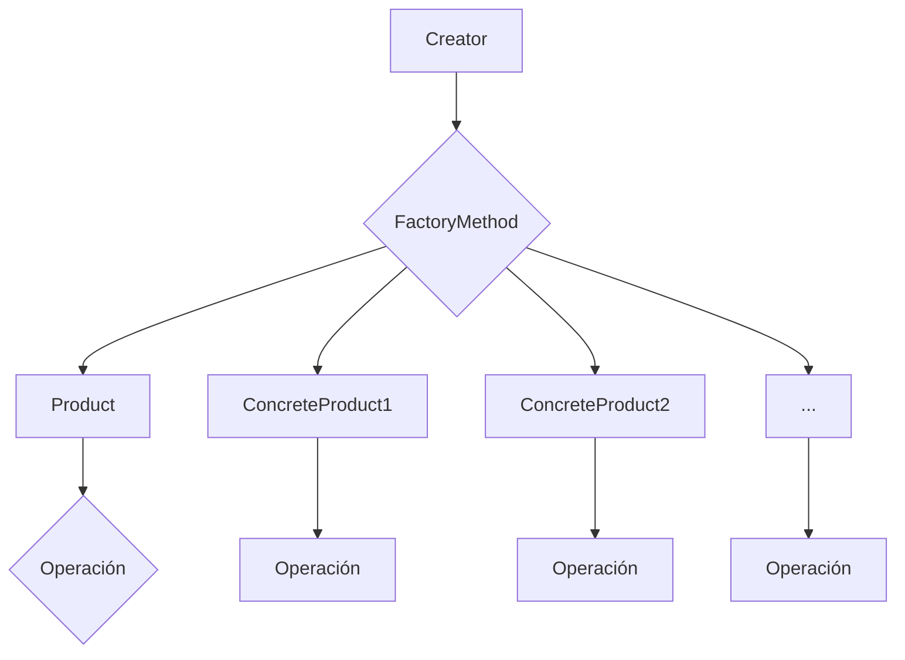

# Factory Method  

El patrón Factory Method se utiliza cuando se necesita crear objetos de un tipo específico, pero las subclases deben decidir la clase concreta a instanciar. Esto proporciona flexibilidad en la creación de objetos y permite que las subclases cambien la lógica de creación sin afectar al código cliente que utiliza el Factory Method.
- Creator: Es la clase abstracta que declara el Factory Method.
- FactoryMethod(): El método abstracto que crea objetos Product. Las subclases lo implementan para crear instancias concretas de Product.
- Product: La interfaz o clase abstracta que define el tipo de objetos que se crearán.
- ConcreteProduct1, ConcreteProduct2, ...: Las clases concretas que implementan Product y son creadas por FactoryMethod().
- Operación(): Un método definido en Product que realiza una operación específica.

