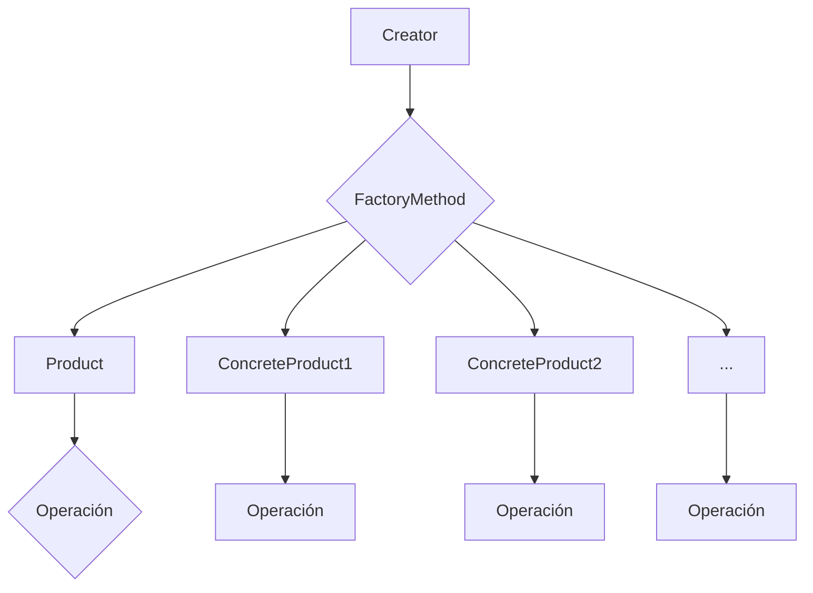

# Factory Method  

```mermaid
graph TD
    A[Creator]
    A --> B{FactoryMethod}
    B --> C[Product]
    B --> D[ConcreteProduct1]
    B --> E[ConcreteProduct2]
    B --> F[...]
    C --> G{Operación}
    D --> H[Operación]
    E --> I[Operación]
    F --> J[Operación]
```
