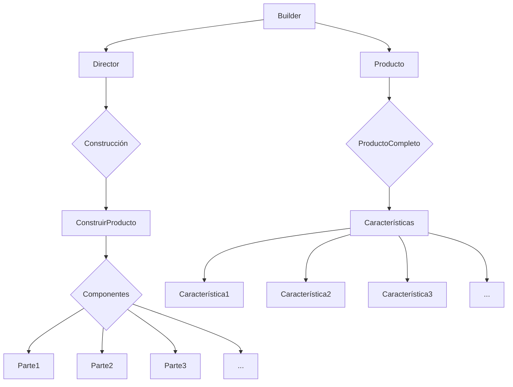

# Factory Method  

```mermaid
graph TD
    A[Builder]
    A --> B[Director]
    A --> C[Producto]
    B --> D{Construcción}
    D --> E[ConstruirProducto]
    E --> F{Componentes}
    F --> G[Parte1]
    F --> H[Parte2]
    F --> I[Parte3]
    F --> J[...]
    C --> K{ProductoCompleto}
    K --> L[Características]
    L --> M[Característica1]
    L --> N[Característica2]
    L --> O[Característica3]
    L --> P[...]
```
