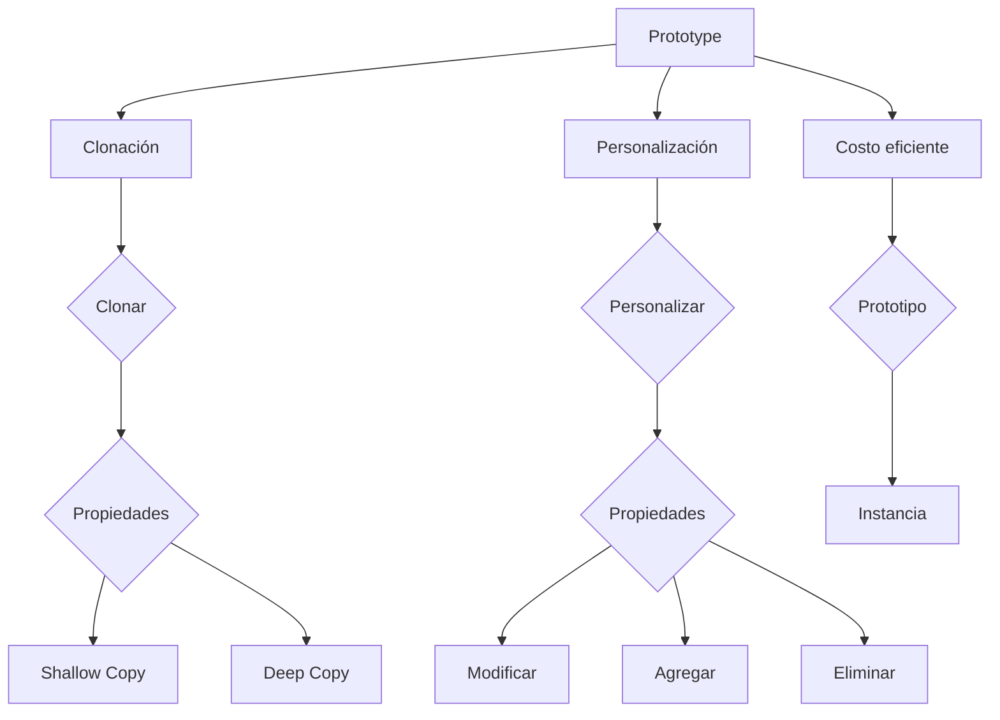

# Prototype

El patrón Prototype es útil cuando deseas crear objetos similares con diferencias mínimas y evitar la creación costosa de objetos desde cero.
Prototype: Es el objeto base que se clona para crear otros objetos.
- Clonación: Se refiere a la creación de copias de un objeto prototipo.
- Personalización: Permite modificar las copias para adaptarlas a diferentes necesidades.
- Costo eficiente: La clonación de prototipos es más eficiente en términos de recursos que crear objetos desde cero.
- Clonar: Es el proceso de copiar un objeto prototipo.
- Propiedades: Son los atributos y métodos del objeto.
- Shallow Copy: Una copia superficial solo clona las propiedades superficiales, mientras que las propiedades anidadas siguen siendo compartidas.
- Deep Copy: Una copia profunda clona tanto las propiedades superficiales como las anidadas, creando objetos completamente independientes.
- Personalizar: Implica modificar las propiedades de un objeto clonado.
- Modificar: Cambiar el valor de una propiedad existente.
- Agregar: Añadir nuevas propiedades o métodos.
- Eliminar: Quitar propiedades o métodos.
- Prototipo: El objeto base que se clona.
- Instancia: La copia resultante de un objeto prototipo.

