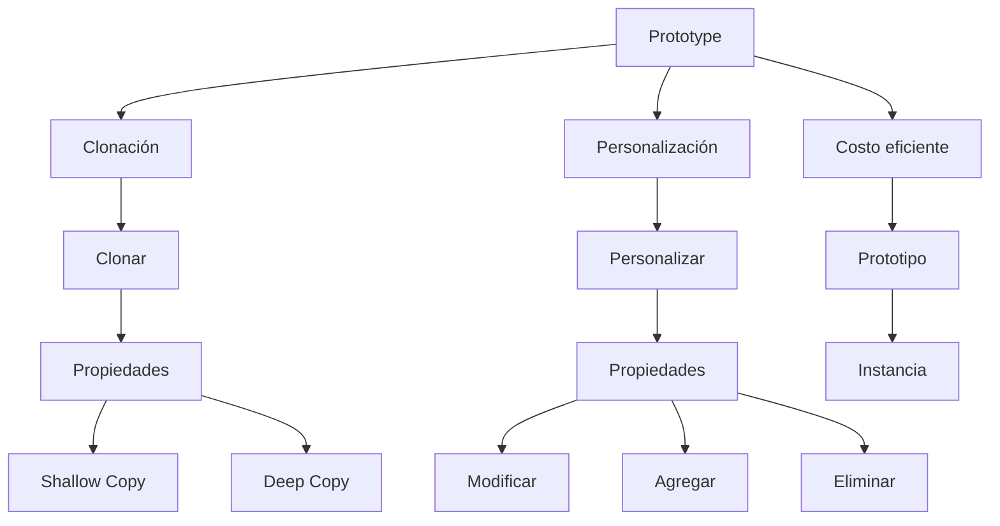

# Prototype

```mermaid
graph TD
    A[Prototype]
    A --> B[Clonación]
    A --> C[Personalización]
    A --> D[Costo eficiente]
    B --> E[Clonar]
    E --> F[Propiedades]
    F --> G[Shallow Copy]
    F --> H[Deep Copy]
    C --> I[Personalizar]
    I --> J[Propiedades]
    J --> K[Modificar]
    J --> L[Agregar]
    J --> M[Eliminar]
    D --> N[Prototipo]
    N --> O[Instancia]
```
