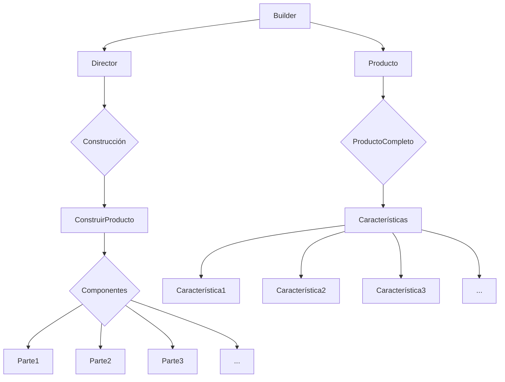

# Singleton

```mermaid
graph TD
    A[Singleton]
    A --> B{instancia única}
    A --> C{getInstance()}
    C --> D[Instancia existente]
    C --> E[Crear instancia si no existe]
```

Singleton es un patrón de diseño creacional que garantiza que tan solo exista un objeto de su tipo y proporciona un único punto de acceso a él para cualquier otro código.

